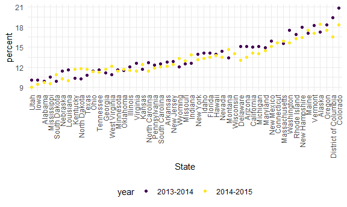
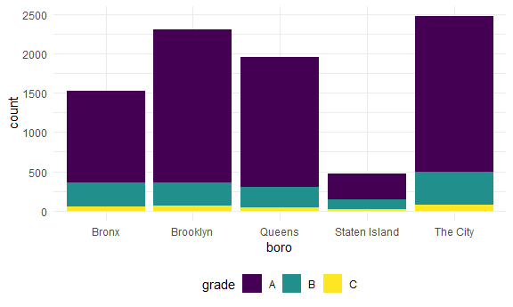
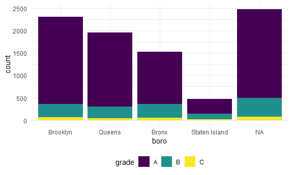
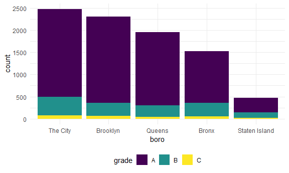

Srings and Factors
================
Yu He
10/26/2021

## String vectors

``` r
string_vec = c("my", "name", "is", "jeff")

str_detect(string_vec, "jeff")
```

    ## [1] FALSE FALSE FALSE  TRUE

``` r
str_replace(string_vec, "e", "This is an uppercase E")
```

    ## [1] "my"                        "namThis is an uppercase E"
    ## [3] "is"                        "jThis is an uppercase Eff"

‘^’ means the beginning of the line, ’$’end of the line

``` r
string_vec = c(
  "i think we all rule for participating",
  "i think i have been caught",
  "i think this will be quite fun actually",
  "it will be fun, i think"
  )

str_detect(string_vec, "^i think")
```

    ## [1]  TRUE  TRUE  TRUE FALSE

``` r
str_detect(string_vec, "i think$")
```

    ## [1] FALSE FALSE FALSE  TRUE

``` r
string_vec = c(
  "Y'all remember Pres. HW Bush?",
  "I saw a green bush",
  "BBQ and Bushwalking at Molonglo Gorge",
  "BUSH -- LIVE IN CONCERT!!"
  )

str_detect(string_vec,"[Bb]ush")
```

    ## [1]  TRUE  TRUE  TRUE FALSE

``` r
string_vec = c(
  '7th inning stretch',
  '1st half soon to begin. Texas won the toss.',
  'she is 5 feet 4 inches tall',
  '3AM - cant sleep :('
  )

str_detect(string_vec, "^[0-9][a-zA-Z]")
```

    ## [1]  TRUE  TRUE FALSE  TRUE

’.’can be anything you want it to be.

``` r
string_vec = c(
  'Its 7:11 in the evening',
  'want to go to 7-11?',
  'my flight is AA711',
  'NetBios: scanning ip 203.167.114.66'
  )

str_detect(string_vec, "7.11")
```

    ## [1]  TRUE  TRUE FALSE  TRUE

find the’\[’ in the strings. use’\\’ to indicate the ‘\[’ is the
character.\]’, ‘:-\[’, ‘I found the answer on pages \[6-7\]’ )

str_detect(string_vec, “\\\[”)

## \[1\] TRUE FALSE TRUE TRUE


    ## Why factors are weired


    ```r
    factor_vec = factor(c("male", "male", "female", "female"))

    as.numeric(factor_vec)

    ## [1] 2 2 1 1

``` r
factor_vec_sex = fct_relevel(factor_vec, "male")
as.numeric(factor_vec_sex)
```

    ## [1] 1 1 2 2

## NSDUH

``` r
nsduh_url = "http://samhda.s3-us-gov-west-1.amazonaws.com/s3fs-public/field-uploads/2k15StateFiles/NSDUHsaeShortTermCHG2015.htm"

table_marj =
  read_html(nsduh_url) %>% 
  html_table() %>% 
  first() %>% 
  slice(-1)
```

Let’s clean this up

``` r
marj_df =
  table_marj %>% 
  select(-contains("P Value")) %>% 
  pivot_longer(
    -State,
    names_to = "age_year",
    values_to = "percent"
  ) %>% 
  separate(age_year, into = c("age", "year"), "\\(") %>% 
  mutate(
    year = str_replace(year, "\\)", ""),
    percent = str_replace(percent, "[a-c]$", ""),
    percent = as.numeric(percent)
  ) %>% 
  filter(!(State %in% c("Total U.S.", "Northeast", "Midwest", "South", "West")))
```

Do date frame stuff

``` r
marj_df %>% 
  filter(age == "12-17") %>% 
  mutate(
    State = fct_reorder(State, percent)
  ) %>% 
  ggplot(aes(x = State, y = percent, color = year)) +
  geom_point() +
  theme(axis.text.x = element_text(angle = 90, vjust = 0.5, hjust = 1))
```



## Restaurant inspections

``` r
data("rest_inspec")
```

``` r
rest_inspec %>% 
  janitor::tabyl(boro, grade)
```

    ##           boro     A     B    C Not Yet Graded   P    Z   NA_
    ##          BRONX 13688  2801  701            200 163  351 16833
    ##       BROOKLYN 37449  6651 1684            702 416  977 51930
    ##      MANHATTAN 61608 10532 2689            765 508 1237 80615
    ##        Missing     4     0    0              0   0    0    13
    ##         QUEENS 35952  6492 1593            604 331  913 45816
    ##  STATEN ISLAND  5215   933  207             85  47  149  6730

``` r
rest_inspec = 
  rest_inspec %>% 
  filter(
    str_detect(grade, "[ABC]"),
    !(boro == "Missing")
  ) %>% 
  mutate(
    boro = str_to_title(boro)
  )
```

``` r
rest_inspec %>% 
  filter(
    str_detect(dba, "[Pp][Ii][Zz][Zz][Aa]")
  ) %>% 
  janitor::tabyl(boro, grade)
```

    ##           boro    A   B  C
    ##          Bronx 1170 305 56
    ##       Brooklyn 1948 296 61
    ##      Manhattan 1983 420 76
    ##         Queens 1647 259 48
    ##  Staten Island  323 127 21

``` r
rest_inspec %>% 
    filter(str_detect(dba, "[Pp][Ii][Zz][Zz][Aa]")) %>%
  mutate(
    boro = fct_infreq(boro)
  ) %>% 
  ggplot(aes(x = boro, fill = grade)) + 
  geom_bar() 
```


What about changing a lable

``` r
rest_inspec %>% 
  filter(str_detect(dba, "[Pp][Ii][Zz][Zz][Aa]")) %>%
  mutate(
    boro = fct_infreq(boro),
    boro = str_replace(boro, "Manhattan", "The City")) %>%
  ggplot(aes(x = boro, fill = grade)) + 
  geom_bar() 
```



``` r
rest_inspec %>% 
  filter(str_detect(dba, "[Pp][Ii][Zz][Zz][Aa]")) %>%
  mutate(
    boro = fct_infreq(boro),
    boro = replace(boro, which(boro == "Manhattan"), "The City")) %>%
  ggplot(aes(x = boro, fill = grade)) + 
  geom_bar()
```

    ## Warning in `[<-.factor`(`*tmp*`, list, value = "The City"): invalid factor
    ## level, NA generated



more functions can be found by google R ‘fct\_’ how do i do something

``` r
rest_inspec %>% 
    filter(str_detect(dba, "[Pp][Ii][Zz][Zz][Aa]")) %>%
  mutate(
    boro = fct_infreq(boro),
    boro = fct_recode(boro, "The City" = "Manhattan")
  ) %>% 
  ggplot(aes(x = boro, fill = grade)) + 
  geom_bar() 
```


